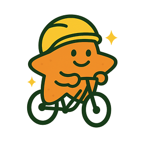

# ⭐ 별 따라 안전 운전 
> 고령 이륜차 운전자를 위한 안전 교육 게임

</img> 
</img> 

##  프로젝트 개요

> 별 따라 안전 운전은 고령 이륜차 운전자를 대상으로 한 웹 기반 안전 교육 게임입니다.  
기존의 지루한 강의식 교육을 벗어나 몰입감 높은 시뮬레이션 게임을 통해 실제적이고 효과적인 안전 교육을 제공합니다.

## 프로젝트 목표
- **재미있는 교육**: 게임을 통한 흥미로운 안전 교육 경험 제공
- **고령자 맞춤**: 고령층의 특성을 고려한 직관적인 UI/UX 설계
- **실용적 학습**: 실제 농촌 환경의 위험 상황을 반영한 교육 내용
- **행동 변화**: 게임 후 실제 안전 운전 행동 유도

## 주요 기능
### 🧭 게임 흐름  
🏠 **시작 화면** → 🎬 **프롤로그** → 🏍️ **주행 시뮬레이션** → 📊 **결과 화면**

### 🎯 5가지 안전 퀘스트

| 퀘스트 주제          | 게임 방식 설명                            |
|---------------------|------------------------------------------|
| 🪖 안전모 착용       |  카드 쌍 맞추기 게임                     |
| 🕳️ 포트홀 안전 주행   |  상황별 선택 퀘스트                       |
| 🍶 음주 운전 예방     |  막걸리 치우기 게임                       |
| 🍎 과수원 안전 주행     |  위험 상황 인지 퀘스트                    |
| 🌙 야간 주행 자제     |  시간 설정 인터랙티브 게임                |

### 🎨 사용자 경험 특징
- 🖱️ **직관적 UI**: 큰 버튼, 명확한 색상 대비
- 🐢 **느린 전환**: 고령층 눈높이에 맞춘 화면 전환 속도
- 📖 **스토리텔링**: 선택 결과에 따라 사고 관련 화면과 손자/손녀 캐릭터의 반응을 통해 몰입도 높은 학습 제공
- 🔊 **음성 지원**: 게임 내 상황에 맞춘 효과음으로 흥미 유도

## 🛠️ 기술 스택
### UI/UX Design 
- 🎨 Figma  
### Frontend
- ⚛️ React  
### Backend
- 📦 Firebase / Firestore

### Features
웹 접근성: WAI-ARIA 준수로 고령자와 약자도 쉽게 사용 가능
모바일 지원: 태블릿 환경 최적화 UI 제공

## 👥 참여 기관 및 파트너
| 🛠 개발팀             | 💡 기술 파트너        | 🏢 운영 기관       | 📍 시범 지역           |
|----------------------|-----------------------|---------------------|-------------------------|
| 한양대학교 불가사리팀 |  (주)별따러가자       | 한국교통안전공단     | 충청남도 예산군청        |
